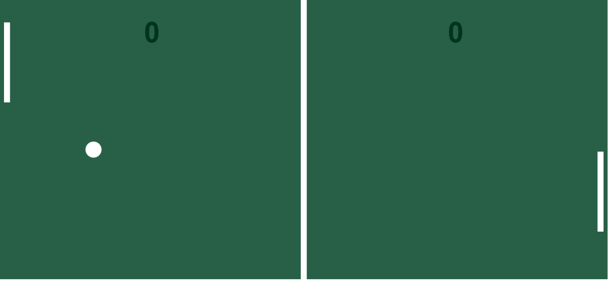

# Projeto Ping-Pong

## 💻 _ping-pong_

Se divirta e passe o tempo jogando um ping-pong 100% funcional.

## 💻 Projeto desenvolvido

<a href="https://gabrieldiasdev.github.io/ping-pong/" target="_blank">Acesse o projeto</a>

## 💡 Info

O projeto contém uma interface moderna inspirada em um jogo de ping-pong, podendo alterar a posição da raquete esquerda com o mover do seu mouse;

## 🔨 Funcionalidades

- Mover raquete com o mouse.
- A cada ponto o jogo fica mais rápido.
- Mostrar o placar do jogo.

## 💻 Tecnologias/Pacotes utilizados

**Frontend**

- Html
- Javascript
- Canvas

## 👨‍💻 Autor

Gabriel Dias Catarin, desenvolvedor web | Bauru, São Paulo

[ LinkedIn](https://www.linkedin.com/in/gabriel-dias-260857207/)
&nbsp;
